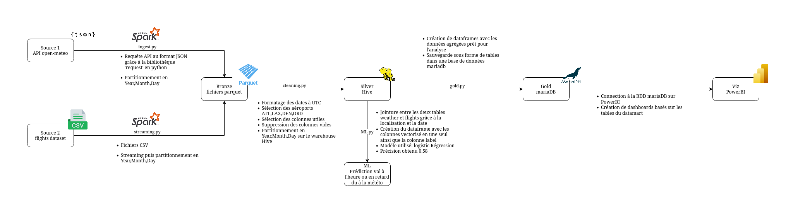

# projet_spark

## Overview

`projet_spark` is a data processing pipeline built with Apache Spark, designed to handle data ingestion, cleaning, transformation, and machine learning tasks.
The project follows a multi-layered architecture, including Bronze, Silver, and Gold layers, to manage data at different stages of processing.

## Architecture



The architecture comprises the following layers:

- **Bronze Layer**: Raw data ingestion and storage.
- **Silver Layer**: Cleaned and structured data and machine learning.
- **Gold Layer**: Aggregated data ready for analytics.

## Features

- **Data Ingestion**: Handles the extraction of raw data into the Bronze layer.
- **Streaming**: Supports real-time data processing using Spark Streaming.
- **Data Cleaning**: Processes and cleans data, storing the results in the Silver layer.
- **Machine Learning**: Applies ML models to the processed data for predictive analytics.
- **Data Transformation**: Aggregates and transforms data for analytical purposes in the Gold layer.


## Project Structure

```
projet_spark/
├── bronze/                 # Raw data storage
├── silver-warehouse/       # Cleaned data storage
├── metastore_db/           # Metadata storage
├── ingest.py               # Script for data ingestion
├── cleaning.py             # Script for data cleaning
├── gold.py                 # Script for data transformation
├── streaming.py            # Script for streaming data processing
├── ML.py                   # Script for machine learning tasks
├── architecture.drawio.png # Architecture diagram
├── mysql-connector-j-9.3.0.jar # MySQL JDBC connector
├── .gitignore
└── README.md
```

## Getting Started

### Prerequisites

- Apache Spark in Standalone Mode
- Python 3.x
- mariadb (for gold storage)
- Java (for JDBC connector)

### Installation

1. Clone the repository:
   ```bash
   git clone https://github.com/antoinevdp/projet_spark.git
   cd projet_spark
   ```

2. Install required Python packages:
   ```bash
   pip install -r requirements.txt
   ```

3. Ensure that Apache Spark and MySQL are properly installed and configured on your system.

### Usage

1. Run the data ingestion script:
   ```bash
   spark-submit ingest.py
   ```
2. Start the streaming process:
   ```bash
   spark-submit streaming.py
   ```

3. Clean the ingested data:
   ```bash
   spark-submit cleaning.py
   ```
   
4. Apply machine learning models:
   ```bash
   spark-submit ML.py
   ```

5. Transform the cleaned data:
   ```bash
   spark-submit --jars mysql-connector-j-9.3.0.jar gold.py
   ```